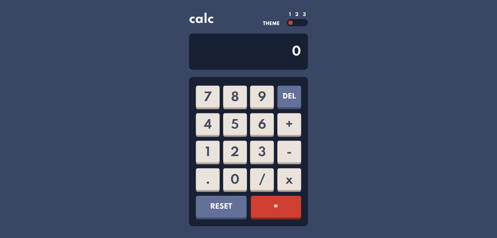

# Frontend Mentor - Calculator app solution

This is a solution to the Calculator app challenge on Frontend Mentor.

## Table of contents

- [Overview](#overview)
  - [The challenge](#the-challenge)
  - [Screenshot](#screenshot)
  - [Links](#links)
  - [My process](#my-process)
  - [Built with](#built-with)
  - [What I learned](#what-i-learned)
  - [Acknowledgments](#acknowledgments)

## Overview
The challenge can be found here: https://www.frontendmentor.io/challenges/calculator-app-9lteq5N29. I completed this challenge in order to help me strengthen my JavaScript, HTML, and CSS skills. Frontend Mentor challenges help you improve your coding skills by building realistic projects.

### The challenge

Users should be able to:

- See the size of the elements adjust based on their device's screen size.
- Perform mathematical operations like addition, subtraction, multiplication, and division.
- Adjust the color theme based on their preference.

### Screenshot

### Links

- Solution URL can be found [here](https://github.com/mya95morris/Calculator-App)
- See the app in action [here](https://sad-cori-00f604.netlify.app/)!

### Built with
- Semantic HTML5 markup
- CSS custom properties
- Flexbox
- CSS Grid
- Mobile-first workflow
- [React](https://reactjs.org/) - JS library
- [Next.js](https://nextjs.org/) - React framework
- [Styled Components](https://styled-components.com/) - For styles

### What I learned

I was truly impressed with the complexity of the calculator logic. It was my first project that didn't feel "basic" or easy, and I loved the challenge. It took me a while getting it right, especially if you want to continue adding or multiplying numbers without hitting the equal sign.

Once I perfected the logic, the problem was that I was using setState to keep the accumulator value. I soon realized that since it was an async function, I had to wait until it updated itself in order to continue my process.

## Author

- Website - [Mya Morris](https://jolly-beaver-a96201.netlify.app/)

## Acknowledgments

Completing the SheCodes Basic workshop, along with other courses and hands on experience inspired me to push through the complex parts of this project. I am a perfectionist, and the time spent working on this project (and making it as PERFECT as possible), FLEW by and was so worth it in the end.
